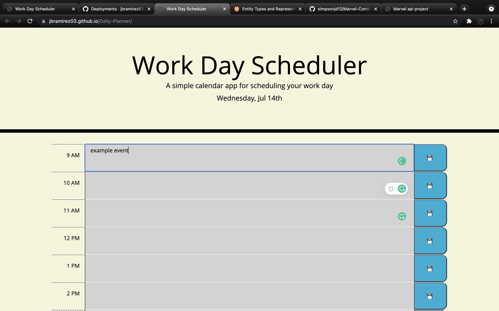
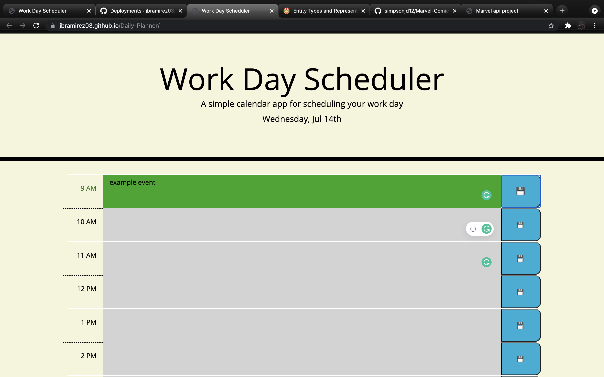

# Daily-Planner

<h2 align="center">Overview</h2>

This is a work planner that is able to save important events you must complete for the day. This is perfect to help you organize your work.
 

# Instructions:
## You enter an event into an hour block depending on when you want to start working on said event.

## You then click the blocks save button in order to save your event even once you refresh the page
